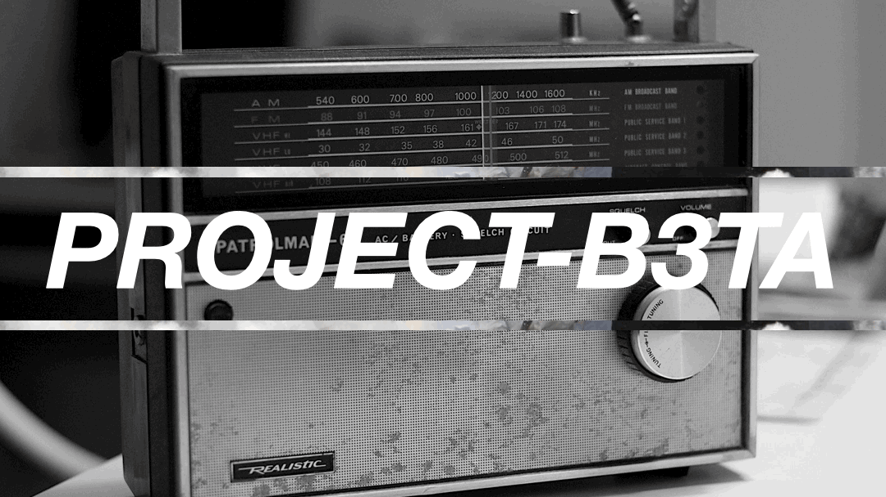
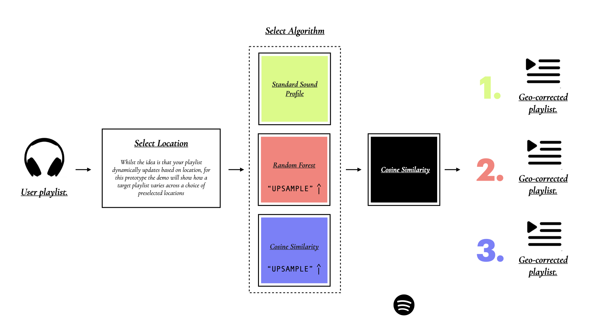

## ***PROJECT-B3TA***
#### **a location-based playlist recommendation system.**  
---

Music and the listening experience is all about dynamics. There's no drop without a break, and there's no chorus without a verse..

***PROJECT-B3TA*** is an exploration into how we could make a recommendation system that's more human, one that changes with the world around us.. The aim? Free ourselves from our bubbles and hear more of the world around us.

===

**Project Overview**

In this project we will explore a number of machine learning techniques (Logistic Regression, Random Forest, SKLearn Gradient Boost, XGBoost) and location-based filtering to recommend a new take on your favourite playlist, adapted to reflect the sound of the city you're 'in'. It's unclear why the DSPs haven't yet experimented with a location based slant to their services but as the world grows apart and people drift deeper into their own echo chambers, as a fan of music, travel and diversity in all its forms it feels like a fertile area for exploration.

In addition to the recommendation engine this project is also accompanied by a selection of data visualisations and commentary documenting the project's insights and findings.

==

**Location**

Given the limited access of actual geographical data available through the Spotify API, our approach sees us creating sound profiles for a number of featured cities to act as a proxy for the sound of a location. In an ideal world this would be combined with actual geographical data relating to listens and details on where a track has been produced / where the artists are from but this will nonetheless be an interesting experiment to see how we can adapt our playlists to reflect the sound of the world around us.

Sound profile locations; *London*, *Manchester*, *Ibiza*, *Berlin*, *Kingston*, *New York City*, *Los Angeles*.

==

**The Data**

Our data has been acquired from a couple of places. Firstly we started off with a million track dataset from Kaggle (link). We then added to this via calls to the Spotify API to access our sound profile tracks which were then joined to the main dataset with any duplicates being dropped. In the final stages of the project we created a function that accessed the data direct from the API to provide dynamic recommendations.

---

**The Notebooks**

*00-b3-spotify-api-access*

This notebook documents the code used to access the Spotify API and create our sound profile datasets. Datasets are saved down to csv locally.

==

*01-b3-loading-cleaning-initial-eda*

Here we begin to conduct our initial assessment of the data including some cleaning and basic EDA. The Kaggle million tracks Spotify dataset (1,159,764, 20) forms the basis of our project which contains the majority of traditional (key, mode, genre, bpm, tempo) and Spotify (danceability, energy, valence etc.) metrics and will be used as the core structure for any additional data imports. Following some basic cleaning involving some simple reassignment of data types, categorical conversion and dropped columns we conducted an initial univariate and bivariate assessment of the data. Both offered insight and also highlighted some areas for future focus including categorical encoding, outlier removal and further column removal to name a few. We also took a brief moment to perform a very basic test of our hypothesis that sounds from a similar should have more in common that tracks from a random sample, here the cosine similarity did suggest potential promise but much more work would need to be done to dig into this further.

==

*02-b3-import-soundprofiles-and-join*

The third of our notebooks sees us import and clean our individual sound profiles before joining to the main dataset. We added a column to denote tracks that belonged to a certain sound profile and also created a 20% version of the dataset to ease pressure on the CPU during experimentation and the initial stages of modelling. In addition to the main dataframes we also created our sound profiles as lists of track ids for easy access irrespective of which main dataset is being used and it also removes the requirement to preserve indices which can be beneficial particularly as DataFrames are scaled and converted to different formats (np arrays, sparse arrays etc.) in preparation for modelling and recommendations.

==

*03-b3-pre-processing-in-depth-eda*

In our fourth notebook we focus on our 20% sample but also process the full DataFrame (genres excluded) in parallel for potential future use. In what is a substantial section of this project, this notebook covers four broad areas, namely; i) further in depth univariate EDA and cleaning/pre-processing, ii) in depth EDA of our sound profiles, iii) further pre-processing and iv) some initial model exploration.

In the first of the four sections we systematically assess each of our features and process accordingly, some features (such as tempo and mode) go unchanged but many area refined using a combination of statistical analysis, knowledge of the field and also anticipation of the modelling process to come. Examples of processing include outlier removal from duration (ms), number of genres reduced down through manual mapping and tracks below -30LUFS loudness removed. In addition we drop a number of columns including year, time signature and popularity (see notebooks for detailed explanation).

Our second major section of this notebook focusses on analysis and the building of insight around our individual sound profiles. All metrics were examined and whilst some such as key offered little promise in respect to acting as a fingerprint for a particular sound profile, others proved interesting, some in line with our expectations, others slightly less so. For example, unsurprisingly for a city know for its parties and electronic dance music Berlin came in with the highest average track duration with just over 6 and half minutes, almost bang on the length of a typical mix designed for club use. Equally on a club theme it was Berlin and Ibiza, who, of all our sound profiles, clearly had the tightest tempo IQRs, again suggesting a lot of the music listened to in those places is designed for being woven together on the dancefloors at around the 125 bpm mark. On the other hand, would you have put the Manchester sound above the likes of London, New York and Berlin in the ‘energy’ stakes? And is it a surprise that sunnier places (Kingston, LA, Ibiza) average a higher valence score? Maybe more sun does produces a happier sound..

The third section of this notebook focusses on some further pre-processing and it is here where we address our categorical variables. Mode is mapped to a binary 1 (Major) or 0 (Minor), and we one hot encode both our key and genres to create a new version of the data frame containing a total of 88 columns. We also scale to leave us with a selection for pre-processed data frames for the modelling stage (df, df20, df20p, df20p_labels, df20p_num, df20p_num_scl).

The final section of this notebook dips a toe into experimentation with k-means clustering, employing PCA and t-SNE to visualise potential clusters in our larger dataset and also exploring the inertia elbow and silhouette scores for a sense of the strongest patterns in our data. The plan was to explore this further, taking a look at patterns in individual sound profiles to offer further insight for modelling our sound profiles but unfortunately time got the better of us. This is definitely an area we could look to explore further in future.

==

*04-b3-modeling-and-recommendations*

In our fifth and final notebook we conduct some final advanced EDA, creating and exploring track archetypes so as to get a little closer to the sonic ‘fingerprint’ of a location. In addition to exploring the archetypes we also employ some logistic regression for the purposes of EDA, extracting and examining the coefficients and odds ratios which helps build further on the picture we established earlier, insights include places that act as cultural hubs where people come together (London, NYC) are more likely to contain tracks with prominent vocals (high ‘speechiness’) and (rather unsurprisingly) Berlin and Ibiza tracks have a high likelihood of being highly ‘danceable’.

Having used logistic regression in our final EDA we continue this line of thinking and begin to explore other models and their ability to predict what constitutes a track from a certain profile. Given our limitations around location we decide to explore a way of building our sound profiles algorithmically using machine learning to see how that might impact our recommendations trialing a number of models including Random Forest, SKLearn Gradient Boost and XGBoost with the winner Random Forest being used to ‘upsample’ our sound profiles (1000 tracks).

With two flavours of recommendation we decided to create a third and final version, this time using a straight cosine similarity to ‘upsample’ our sound profiles from the main dataset (again to 1000 tracks).

In the final stage of this project we build a consolidated recommender function and integrate with the Spotify API to allow for dynamic playlist recommendations for any playlist on spotify (max 20 tracks) which also has the feature of being able to post your playlists back up to spotify via the API.

Whilst time unfortunately got the better of us, it’s fair to say we covered a huge spectrum of work over a very short period time and there is plenty of room for future exploration. The simple cosine similarity and basic sound profile combination may have led to the best recommendations in this instance but the upsampling through Random Forest and Cosine Sim methods both showed promise and with unexplored areas such as the pre-processed DataFrame containing genre, key and mode information there is likely a lot of room for improvement ahead.

===

**What next?**

It’s been astounding to see just how powerful the relatively simple cosine similarity can be and there are a host of areas prime for further exploration.

Firstly it probably goes without saying tackling the lack of actual location information will be an initial focus. Whilst sound profiles will still play an important role, having information on which artists and sounds come from a certain place will really open up the potential of this idea making it theoretically possible to create a geo-corrected playlist for any place which has birthed 50+ tracks.

In parallel to accessing the location data improving the existing sound profiles themselves will also likely significantly improve performance. Whilst it would be great to expand the number of profiles, the first focus will be on improving the quality of our current recommendations. Initial thoughts include redesigning sound profiles to comprise of 2x playlists; ‘classic’, containing tracks that have defined the sound of a place over the years and ‘contemporary’, the tracks that are currently being produced and represent the present day sound of an area. Both playlists would be blended via a percentage filter to define a location's final sound to be used for recommendations. The advantage of this approach would mean a more layered, dynamic and real sound with the contemporary playlist being kept regularly up to date for an accurate representation of a scene, there is even the potential to collaborate with local tastemakers who can guest-curate the ‘contemporary’ playlists allowing for an authentic and ever-evolving take that can be married with the classics to taste. It's easy to see how this approach could grow, anything from supporting local artists and promoting gigs to people from out of town through to offering the user a customisable slider to blend in the right amount of contemporary and classic sound.

In addition to added sound profile sophistication, with more data such as location and accurate track publication information there would be the possibility of building on the algorithm 'flavour' toggle, allowing the user to select settings such as ‘new’ to focus on new music, ‘pop’ to focus on the most popular sounds of an area and possibly even a ‘sp’ setting using ML to predict similar sounding tracks irrespective of area in a similar manner to our random forest ‘upsampling’ experiments during this project.

On top of all this, there are a host of simple builds such as factoring in mode, key, genre and playing with weightings (e.g. increase tempo) that could prove to be quick wins and of course more involved areas for exploration such as neural networks and advanced audio analysis (e.g. identification of instrumentation timbre, track macrodynamics etc.) and lots more.

With so more still to explore, it’s probably fair to say this isn’t quite the end of the road for this project just yet...

---

**The contents of this file include**:
- `flowchart` - folder containing flowchart from the README.md
- `notebooks` - folder containing all .ipynb files that are necessary to run the notebooks
- `README.md` - this README
- `requirements.txt` - environment / system requirements
- `v2-project-b3ta-data-dictionary-cln.csv` - data dictionary
- & the sprint presentation pdfs

---

**The notebooks contained within** `notebook` **are as follows**:

1. `00-b3-spotify-api-access`
    - Contains code used to access our sound profiles.
2. `01-b3-loading-cleaning-initial-eda`
    - Contains code and commentary for the loading, cleaning and initial eda of the datasets. Also includes merging of sound_profile datasets and sampling of the 20% DF.
3. `02-b3-importing-soundprofiles-and-joining`
    - Contains code and commentary for the importing cleaning and joining of the sound profiles to the main dataset along with taking a 20% sample.
4. `03-b3-extended-cleaning-eda-and-pre-processing`
    - Contains code and commentary explaning the further exploration and analysis of the data including a deep dive on each location (still wip) plus further cleaning, pre-processing and some very early (and very rough!) stage model experimentation.
5. `04-b3-modeling-and-recommendations`
    - Contains code and commentary explaining the modelling process and recommendation engine design. Also includes creation of functions and integration with the Spotify API.

===

**Flowchart**:

---

**The dataset can be downloaded here**: [link](https://drive.google.com/file/d/1Cmr5du_ICCkevFzQ3u2-8uwfDzQgOT9Y/view?usp=drive_link)              

---
